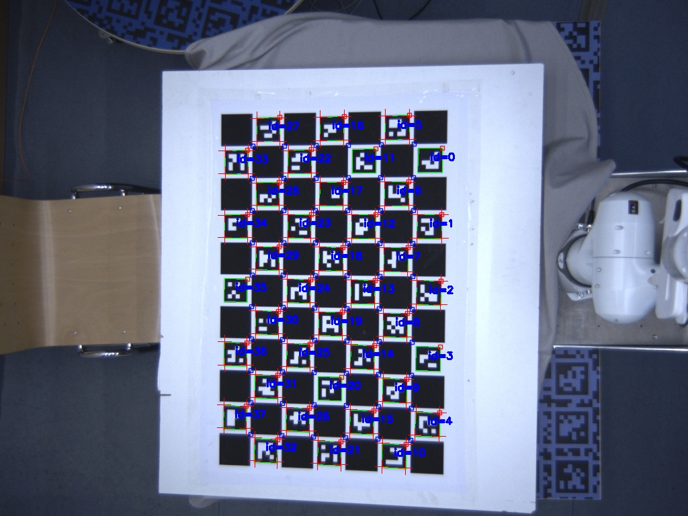

# 📷 multi-camera-calib

[](https://zenodo.org/badge/latestdoi/991966353)

**multi-camera-calib** is a package for calibrating synchronized multi-camera setups, designed for robotic platforms. It captures calibration data, runs ChArUco-based calibration, and validates the results with 3D backprojection.



---

## 📑 Citation

If you use this software in your work, please cite it using the **“Cite this repository”** button on the top-right of this page.

## 🔧 Installation

### Dependencies

This package forms an essential part for my [docker-based real-time 3d tracker](TODO-Path). It mainly depends on these two modules

* [cpp_utils](https://github.com/HenrikTrom/cpp_utils)

* [flirmulticamera](https://github.com/HenrikTrom/flirmulticamera)

To build the package, simply run:

```bash
./scripts/build.sh
```

## Usage

### 1. Prepare a Calibration Target

Use a ChArUco board similar to the one shown in the example image above.

### 2. Configure Calibration Settings

Edit the configuration file `./cfg/CameraCalibrationSettings.json` to match your setup:

```json
{
    "pattern_size_first": 11,
    "pattern_size_second": 7,
    "charuco_params_border_size": 1.0, # pixels
    "charuco_params_dict": 0, # dict id
    "charuco_params_marker_border_pixel": 1,
    "charuco_params_marker_to_square_ratio": 0.75, 
    "charuco_params_square_size": 80.0, # mm
    "savedir": "/home/docker/workspace/workspace/multi-camera-calib/data/results"
}
```

### 3. Run the calibration routine

Start the calibration process:

```bash
./scripts/calibration.sh
```

#### What the script does:

* Waits 10 seconds for you to get the calibration board into view
* Records video for 15 seconds from each camera
* Extracts frames from the video streams
* Runs the calibration using the extracted frames
* Validates the calibration and stores results in `./test`

Make sure to move the calibration board smoothly and visibly during the recording phase (approx. 25 seconds total).

## Acknowledgements

The core of the calibration code is adapted from [Multi\_Camera\_Calibration](https://gitlab.com/ungetym/Multi_Camera_Calibration/-/blob/master/LICENSE?ref_type=heads). To streamline re-calibration, the GUI was removed and replaced with JSON-based configuration.